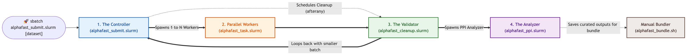
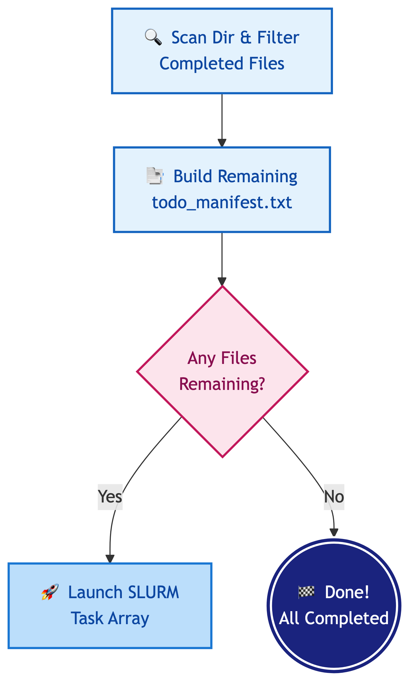
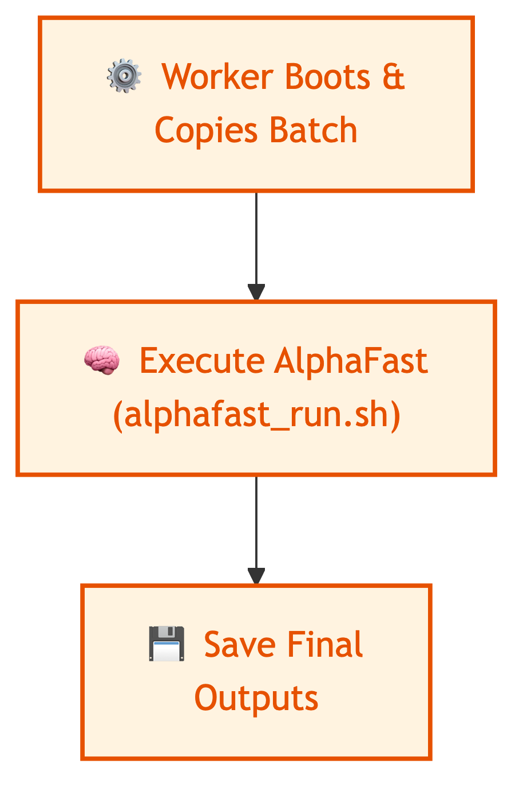
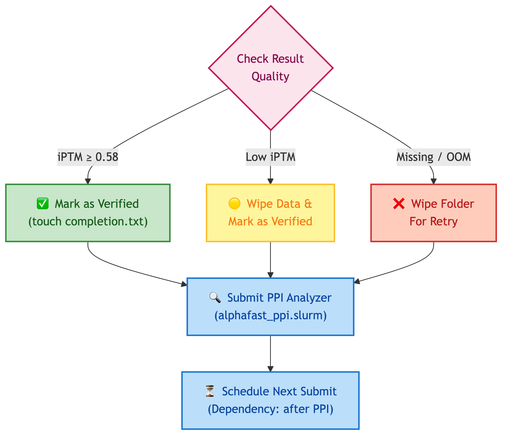
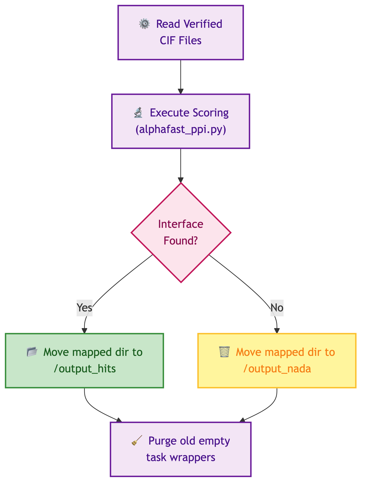
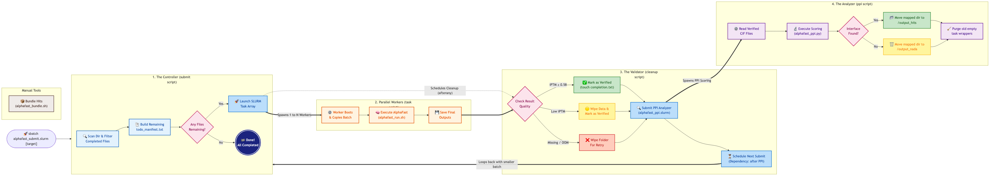

# Co-Folding Against Human Proteome; Protein-Protein Interactions (PPI)

This pipeline will download all human protein sequences from [STRING](https://string-db.org/cgi/download?sessionId=bVGGWIlTNLo8&species_text=Homo+sapiens&settings_expanded=0&min_download_score=0&filter_redundant_pairs=0&delimiter_type=txt) and create pairwise input files for each target sequence vs each protein sequence in the proteome for AlphaFast-style workflows.

Create a targets.tsv file with the following columns:

- id (name of your target sequence)
- type (protein, DNA, RNA, ligand)
- sequence

Example:

```{tsv}
id	type	sequence
p1	protein	ILAMKALGA
d1	DNA	GATTACA
```

```{bash}
module load nextflow # or use conda

nextflow run main.nf \
    -profile slurm \            # use this only if on a SLURM HPC
    --targets all_targets.tsv \ # custom input, default: targets.tsv
    --filetype json             # json, yaml, or other supported types
    --squashfs true             # build squashfs inputs and submit alphafast jobs
  --alphafast true            # submit alphafast jobs for each squashfs prefix
```

  The result: numerous input files in tarballs and optional squashfs images (`*-af3-pipeline-input-<filetype>.sqf`).

  Sparrow features are generated for monomer inputs as part of the pipeline.

  When both `--squashfs true` and `--alphafast true` are enabled, the workflow also runs:

  ```bash
  sbatch alphafast_submit.slurm [STRUCTURE]
  ```

  for each squashfs prefix (`[STRUCTURE]` from `<STRUCTURE>-af3-pipeline-input-<filetype>.sqf`).


# Alphafast



```
alphafast_submit.slurm 
  --> determine batch size and number of jobs to submit
  --> start/submit jobs
  --> schedule cleanup after all are done
```



```
alphafast_task.slurm   --> wrapper for task
alphafast_run.sh       --> the actual alphafolding
```



```
alphafast_cleanup.slurm 
  --> cleans up failed runs
  --> deletes large/obsolete files from 'nada' runs with low ipTM
  --> submits PPI script
  --> schedules a resubmit after
```



```
alphafast_ppi.slurm/alphafast_ppi.py 
  --> runs ppi script
  --> then organizes outputs into 
      $SCRATCH/alphafast/[STRUCTURE] 
          /output_hits
          /output_nada (success but no PPI)

(after this alphafast_submit.slurm is automatically called until all structures are finished)
```



```
alphafast_bundle.sh --> helper script to make a neat .tar.gz of all the PPI hits to date (all [STRUCTURE]s and all relevant files)!
```

```bash
$ sbatch alphafast_submit.slurm [STRUCTURE]
```

